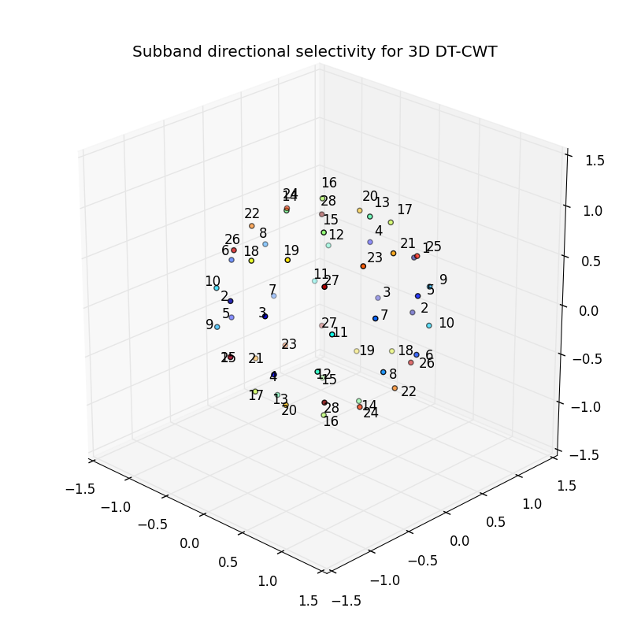

Example scripts
===============

.. _3d-directional-example:

Showing 3D Directional Sensitivity
----------------------------------

The
:download:`3d_dtcwt_directionality.py<../examples/3d_dtcwt_directionality.py>`
script in the examples directory shows how one may demonstrate the directional
sensitivity of the 3D DT-CWT complex subband coefficients. It computes
empirically the maximally sensitive directions for each subband and plots them
in an interactive figure using matplotlib. A screenshot is reproduced below:

There are some points to note about this diagram. Each subband is labeled sich
that '1' refers to the first subband, '5' the fifth and so forth. On this
diagram the highpasses are all four apart reflecting the fact that, for example,
highpasses 2, 3 and 4 are positioned in the other four quadrants of the upper
hemisphere reflecting the position of subband 1. There are seven visible
subband directions in the +ve quadrant of the hemisphere and hence there are 28
directions in total over all four quadrants.

The source for the script is shown below:

.. literalinclude:: ../examples/3d_dtcwt_directionality.py

2D Image Registration
---------------------

This library includes support for 2D image registration modelled after the 3D
algorithm outlined in the paper `Efficient Registration of Nonrigid 3-D Bodies`_.
The
:download:`image-registration.py<image-registration.py>`
script in the examples directory shows a complete worked example of using the
registration API using two sets of source images: a woman playing tennis and some
traffic at a road junction.

.. _Efficient Registration of Nonrigid 3-D Bodies: http://ieeexplore.ieee.org/xpls/abs_all.jsp?arnumber=5936113

It will attempt to register two image pairs: a challenging sequence from a
video sequence and a sequence from a traffic camera. The result is shown below.

.. plot:: image-registration.py

