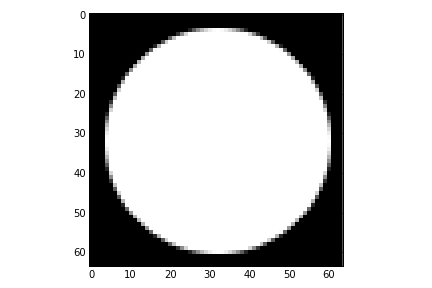
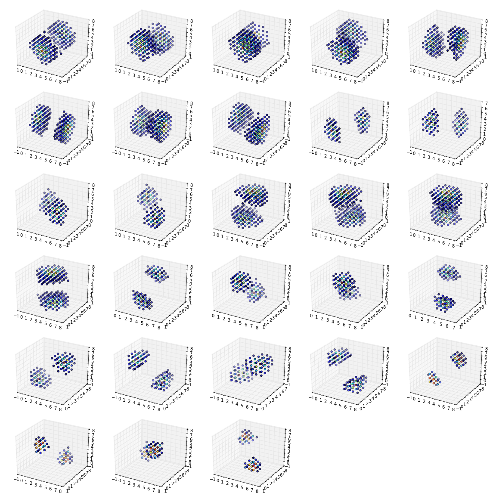

Getting Started
===============

This section will guide you through using the ``dtcwt`` library.  Once
installed, you are most likely to use one of these functions:

* :py:func:`dtcwt.dtwavexfm` -- 1D DT-CWT transform.
* :py:func:`dtcwt.dtwaveifm` -- Inverse 1D DT-CWT transform.
* :py:func:`dtcwt.dtwavexfm2` -- 2D DT-CWT transform.
* :py:func:`dtcwt.dtwaveifm2` -- Inverse 2D DT-CWT transform.
* :py:func:`dtcwt.dtwavexfm3` -- 3D DT-CWT transform.
* :py:func:`dtcwt.dtwaveifm3` -- Inverse 3D DT-CWT transform.

See :doc:`reference` for full details on how to call these functions. We shall
present some simple usage below.

1D transform
------------

This example generates two 1D random walks and demonstrates reconstructing them
using the forward and inverse 1D transforms. Note that
:py:func:`dtcwt.dtwavexfm` and :py:func:`dtcwt.dtwaveifm` will transform
columns of an input array independently::

    import numpy as np
    from matplotlib.pyplot import *

    # Generate a 300x2 array of a random walk
    vecs = np.cumsum(np.random.rand(300,2) - 0.5, 0)

    # Show input
    figure(1)
    plot(vecs)
    title('Input')

    import dtcwt

    # 1D transform
    Yl, Yh = dtcwt.dtwavexfm(vecs)

    # Inverse
    vecs_recon = dtcwt.dtwaveifm(Yl, Yh)

    # Show output
    figure(2)
    plot(vecs_recon)
    title('Output')

    # Show error
    figure(3)
    plot(vecs_recon - vecs)
    title('Reconstruction error')

    print('Maximum reconstruction error: {0}'.format(np.max(np.abs(vecs - vecs_recon))))

    show()

2D transform
------------

Using the pylab environment (part of matplotlib) we can perform a simple
example where we transform the standard 'Lena' image and show the level 2
wavelet coefficients::

    # Load the Lena image from the Internet into a StringIO object
    from StringIO import StringIO
    from urllib2 import urlopen
    LENA_URL = 'http://www.ece.rice.edu/~wakin/images/lena512.pgm'
    lena_file = StringIO(urlopen(LENA_URL).read())

    # Parse the lena file and rescale to be in the range (0,1]
    from scipy.misc import imread
    lena = imread(lena_file) / 255.0

    from matplotlib.pyplot import *
    import numpy as np

    # Show lena on the left
    figure(1)
    imshow(lena, cmap=cm.gray, clim=(0,1))

    import dtcwt

    # Compute two levels of dtcwt with the defaul wavelet family
    Yh, Yl = dtcwt.dtwavexfm2(lena, 2)

    # Show the absolute images for each direction in level 2.
    # Note that the 2nd level has index 1 since the 1st has index 0.
    figure(2)
    for slice_idx in xrange(Yl[1].shape[2]):
        subplot(2, 3, slice_idx)
        imshow(np.abs(Yl[1][:,:,slice_idx]), cmap=cm.spectral, clim=(0, 1))
        
    # Show the phase images for each direction in level 2.
    figure(3)
    for slice_idx in xrange(Yl[1].shape[2]):
        subplot(2, 3, slice_idx)
        imshow(np.angle(Yl[1][:,:,slice_idx]), cmap=cm.hsv, clim=(-np.pi, np.pi))

    show()

If the library is correctly installed and you also have matplotlib installed,
you should see these three figures:

.. figure:: lena-1.png

.. figure:: lena-2.png

.. figure:: lena-3.png

3D transform
------------

In the examples below I assume you've imported pyplot and numpy and, of course,
the ``dtcwt`` library itself::

    import numpy as np
    from matplotlib.pyplot import *
    from dtcwt import *

We can demonstrate the 3D transform by generating a 64x64x64 array which
contains the image of a sphere::

    GRID_SIZE = 64
    SPHERE_RAD = int(0.45 * GRID_SIZE) + 0.5

    grid = np.arange(-(GRID_SIZE>>1), GRID_SIZE>>1)
    X, Y, Z = np.meshgrid(grid, grid, grid)
    r = np.sqrt(X*X + Y*Y + Z*Z)

    sphere = 0.5 + 0.5 * np.clip(SPHERE_RAD-r, -1, 1)

If we look at the central slice of this image, it looks like a circle::

    imshow(sphere[:,:,GRID_SIZE>>1], interpolation='none', cmap=cm.gray)

Performing the 3 level DT-CWT with the defaul wavelet selection is easy::

    Yl, Yh = dtwavexfm3(sphere, 3)

The function returns the lowest level low pass image and a tuple of complex
subband coefficients::

    >>> print(Yl.shape)
    (16, 16, 16)
    >>> for subbands in Yh:
    ...     print(subbands.shape)
    (32, 32, 32, 28)
    (16, 16, 16, 28)
    (8, 8, 8, 28)

Performing the inverse transform should result in perfect reconstruction::

    >>> Z = dtwaveifm3(Yl, Yh)
    >>> print(np.abs(Z - ellipsoid).max()) # Should be < 1e-12
    8.881784197e-15

If you plot the locations of the large complex coefficients, you can see the
directional sensitivity of the transform::

    from mpl_toolkits.mplot3d import Axes3D

    figure(figsize=(16,16))
    nplts = Yh[-1].shape[3]
    nrows = np.ceil(np.sqrt(nplts))
    ncols = np.ceil(nplts / nrows)
    W = np.max(Yh[-1].shape[:3])
    for idx in xrange(Yh[-1].shape[3]):
        C = np.abs(Yh[-1][:,:,:,idx])
        ax = gcf().add_subplot(nrows, ncols, idx+1, projection='3d')
        ax.set_aspect('equal')
        good = C > 0.2*C.max()
        x,y,z = np.nonzero(good)
        ax.scatter(x, y, z, c=C[good].ravel())
        ax.auto_scale_xyz((0,W), (0,W), (0,W))
        
    tight_layout()
            
For a further directional sensitivity example, see :ref:`3d-directional-example`.

.. vim:sw=4:sts=4:et

