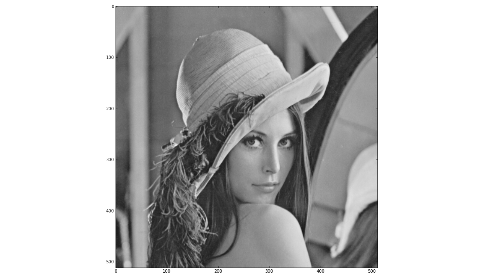
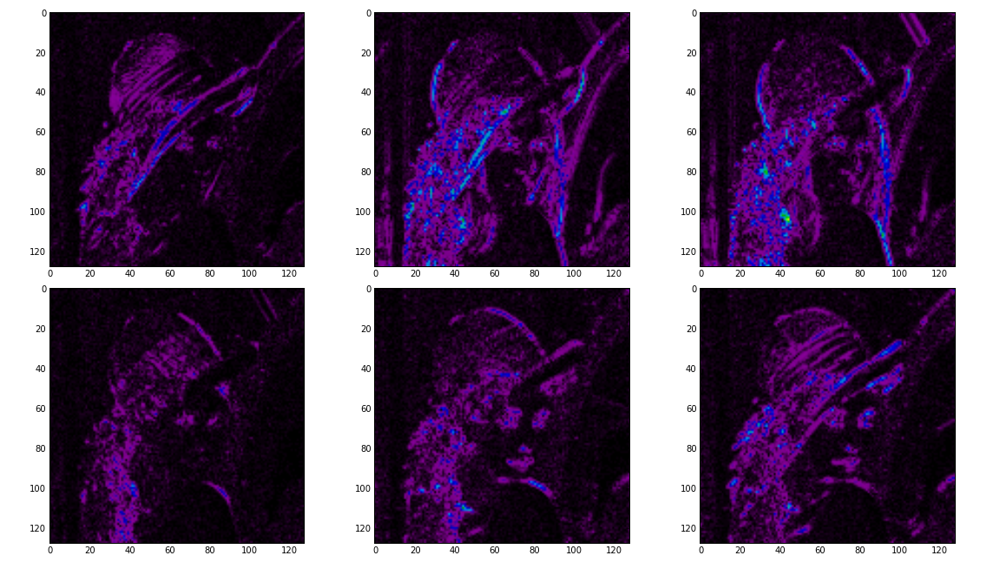
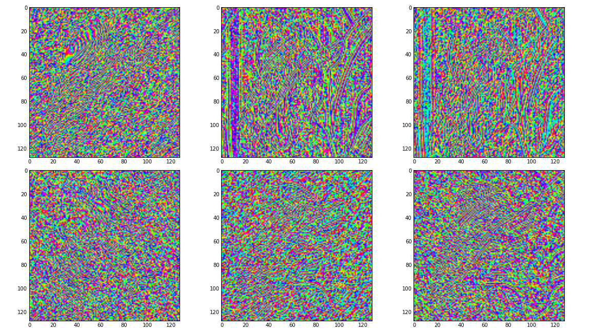

Getting Started
===============

This section will guide you through installing and using the ``dtcwt`` library.

Installation
````````````

Installation is based on setuptools and follows the usual conventions for a
Python project

.. code-block:: console

    $ python setup.py install

A minimal test suite is provided so that you may verify the code works on your
system

.. code-block:: console

    $ python setup.py nosetests

This will also write test-coverage information to the ``cover/`` directory.

Simple usage
````````````

Once installed, you are most likely to use one of four functions:

* :py:func:`dtcwt.dtwavexfm` -- 1D DT-CWT transform.
* :py:func:`dtcwt.dtwaveifm` -- Inverse 1D DT-CWT transform.
* :py:func:`dtcwt.dtwavexfm2` -- 2D DT-CWT transform.
* :py:func:`dtcwt.dtwaveifm2` -- Inverse 2D DT-CWT transform.

See :doc:`reference` for full details on how to call these functions. We shall
present some simple usage below.

1D transform
------------

This example generates two 1D random walks and demonstrates reconstructing them
using the forward and inverse 1D transforms. Note that
:py:func:`dtcwt.dtwavexfm` and :py:func:`dtcwt.dtwaveifm` will transform
columns of an input array independently::

    import numpy as np
    from matplotlib.pyplot import *

    # Generate a 300x2 array of a random walk
    vecs = np.cumsum(np.random.rand(300,2) - 0.5, 0)

    # Show input
    figure(1)
    plot(vecs)
    title('Input')

    import dtcwt

    # 1D transform
    Yl, Yh = dtcwt.dtwavexfm(vecs)

    # Inverse
    vecs_recon = dtcwt.dtwaveifm(Yl, Yh)

    # Show output
    figure(2)
    plot(vecs_recon)
    title('Output')

    # Show error
    figure(3)
    plot(vecs_recon - vecs)
    title('Reconstruction error')

    print('Maximum reconstruction error: {0}'.format(np.max(np.abs(vecs - vecs_recon))))

    show()


2D transform
------------

Using the pylab environment (part of matplotlib) we can perform a simple
example where we transform the standard 'Lena' image and show the level 2
wavelet coefficients::

    # Load the Lena image from the Internet into a StringIO object
    from StringIO import StringIO
    from urllib2 import urlopen
    LENA_URL = 'http://www.ece.rice.edu/~wakin/images/lena512.pgm'
    lena_file = StringIO(urlopen(LENA_URL).read())

    # Parse the lena file and rescale to be in the range (0,1]
    from scipy.misc import imread
    lena = imread(lena_file) / 255.0

    from matplotlib.pyplot import *
    import numpy as np

    # Show lena on the left
    figure(1)
    imshow(lena, cmap=cm.gray, clim=(0,1))

    import dtcwt

    # Compute two levels of dtcwt with the defaul wavelet family
    Yh, Yl = dtcwt.dtwavexfm2(lena, 2)

    # Show the absolute images for each direction in level 2.
    # Note that the 2nd level has index 1 since the 1st has index 0.
    figure(2)
    for slice_idx in xrange(Yl[1].shape[2]):
        subplot(2, 3, slice_idx)
        imshow(np.abs(Yl[1][:,:,slice_idx]), cmap=cm.spectral, clim=(0, 1))
        
    # Show the phase images for each direction in level 2.
    figure(3)
    for slice_idx in xrange(Yl[1].shape[2]):
        subplot(2, 3, slice_idx)
        imshow(np.angle(Yl[1][:,:,slice_idx]), cmap=cm.hsv, clim=(-np.pi, np.pi))

    show()

If the library is correctly installed and you also have matplotlib installed, you should see these three figures:







.. vim:sw=4:sts=4:et

