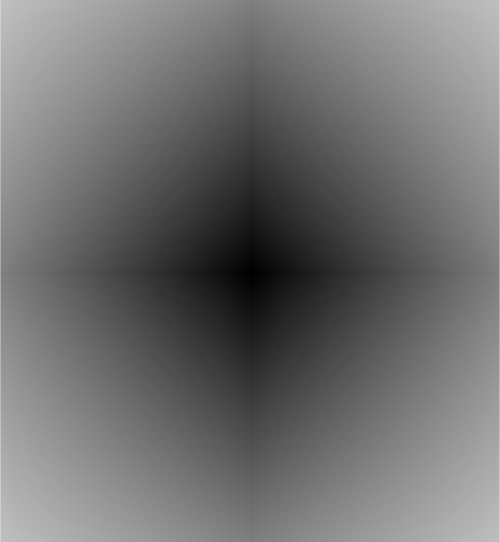

Image Registration
==================

The :py:mod:`dtcwt.registration` module provides an implementation of a
DTCWT-based image registration algorithm. The output is similar, but not
identical, to "optical flow". The underlying assumption is that the source
image is a smooth locally-affine warping of a reference image. This assumption
is valid in some classes of medical image registration and for video sequences
with small motion between frames.

Algorithm overview
------------------

This section provides a brief overview of the algorithm itself. The algorithm
is a 2D version of the 3D registration algorithm presented in `Efficient
Registration of Nonrigid 3-D Bodies
<http://ieeexplore.ieee.org/xpls/abs_all.jsp?arnumber=5936113&tag=1>`_. The
motion field between two images is a vector field whose elements represent the
direction and distance of displacement for each pixel in the source image
required to map it to a corresponding pixel in the reference image. In this
algorithm the motion is described via the affine transform which can represent
rotation, translation, shearing and scaling. An advantage of this model is that
if the motion of two neighbouring pixels are from the same model then they will
share affine transform parameters. This allows for large regions of the image
to be considered as a whole and helps mitigate the aperture problem.

The model described below is based on the model in `Phase-based
multidimensional volume registration
<http://ieeexplore.ieee.org/xpls/abs_all.jsp?arnumber=1176641>`_ with changes
designed to allow use of the DTCWT as a front end.

Motion constraint
'''''''''''''''''

The three-element homogeneous displacement vector at location
:math:`\mathbf{x}` is defined to be

.. math::

    \mathbf{\tilde{v}}(\mathbf{x}) \triangleq \begin{bmatrix}
        \mathbf{v}(\mathbf{x}) \\ 1
    \end{bmatrix}

where :math:`\mathbf{v}(\mathbf{x})` is the motion vector at location
:math:`\mathbf{x} = [ x \, y ]^T`. A motion constraint is a three-element
vector, :math:`\mathbf{c}(\mathbf{x})` such that

.. math::

    \mathbf{c}^T(\mathbf{x}) \, \mathbf{\tilde{v}}(\mathbf{x}) = 0.

In the two-dimensional DTCWT, the phase of each complex highpass coefficient
has an approximately linear relationship with the local shift vector. We can
therefore write

.. math::

    \frac{\partial \theta_d}{\partial t} =
    \nabla_\mathbf{x} \theta_d \cdot \mathbf{v}(\mathbf{x})

where :math:`\nabla_\mathbf{x} \theta_d \triangleq [(\partial \theta_d/\partial
x) \, (\partial \theta_d/\partial y)]^T` and represents the phase gradient at
:math:`\mathbf{x}` for subband :math:`d` in both of the :math:`x` and :math:`y`
directions.

Numerical estimation of the partial derivatives of :math:`\theta_d` can be
performed by noting that multiplication of a subband pixels's complex
coefficient by the conjugate of its neighbour subtracts phase whereas
multiplication by the neighbour adds phase. We can thus construct equivalents
of forward-, backward- and central difference algorithms for phase gradients.

Comparing the relations above, it is clear that the motion constraint vector,
:math:`\mathbf{c}_d(\mathbf{x})`, corresponding to subband :math:`d` at location
:math:`\mathbf{x}` satisfies the following:

.. math::

    \mathbf{c}_d(\mathbf{x}) = C_d(\mathbf{x}) \begin{bmatrix}
    \nabla_\mathbf{x} \theta_d  \\ - \frac{\partial \theta_d}{\partial t}
    \end{bmatrix}

where :math:`C_d(\mathbf{x})` is some weighting factor which we can interpret
as a measure of the confidence we have of subband :math:`d` specifying the
motion at :math:`\mathbf{x}`.

This confidence measure can be heuristically designed. The measure used in this
implementation is:

.. math::

    C_d(\mathbf{x}) = \frac{
        \left| \sum_{k=1}^4 u_k^* v_k \right|
    }{
        \sum_{k=1}^4 (\left|u_k\right|^3 + \left|v_k\right|^3) + \epsilon
    }.

where :math:`u_k` and :math:`v_k` are the wavelet coefficients in the reference
and source transformed images, subscripts :math:`k = 1 \dots 4` denote the four
diagonally neighbouring coefficients and :math:`\epsilon` is some small value
to avoid division by zero when the wavelet coefficients are small. It is beyond
the scope of this documentation to describe the design of this metric. Refer to
the `original paper
<http://ieeexplore.ieee.org/xpls/abs_all.jsp?arnumber=5936113&tag=1>`_ for more
details.

Cost function
'''''''''''''

The model is represented via the six parameters :math:`a_1 \dots a_6` such that

.. math::

    \mathbf{v}(\mathbf{x}) =
    \begin{bmatrix}
        1 & 0 & x & 0 & y & 0 \\
        0 & 1 & 0 & x & 0 & y \\
    \end{bmatrix}
    \begin{bmatrix}
    a_1 \\ \vdots \\ a_6
    \end{bmatrix}
    \triangleq
    \mathbf{K}(\mathbf{x}) \, \mathbf{a}.

We then make the following definitions:

.. math::

    \mathbf{\tilde{K}}(\mathbf{x}) \triangleq \begin{bmatrix}
        \mathbf{K}(\mathbf{x}) & \mathbf{0} \\
        \mathbf{0} & 1
    \end{bmatrix},
    \quad
    \mathbf{\tilde{a}} \triangleq \begin{bmatrix}
        \mathbf{a} \\ 1
    \end{bmatrix}

and then the homogenous motion vector is given by

.. math::

    \mathbf{\tilde{v}}(\mathbf{x}) =
    \mathbf{\tilde{K}}(\mathbf{x}) \, \mathbf{\tilde{a}}.

Considering all size subband directions, we have:

.. math::

    \mathbf{c}_d(\mathbf{x}) \, \mathbf{\tilde{K}}(\mathbf{x}) \, \mathbf{\tilde{a}} = 0,
    \quad \forall \ d \in \left\{ 1, \dots, 6 \right\}.

Each location :math:`\mathbf{x}` has six constraint equations for six unknown
affine parameters in :math:`\mathbf{\tilde{a}}`. We can solve for
:math:`\mathbf{\tilde{a}}` by minimising squared error
:math:`\epsilon(\mathbf{x})`:

.. math::
    \begin{align}
        \epsilon(\mathbf{x}) &= \sum_{d=1}^6 \left\|
            \mathbf{c}_d^T(\mathbf{x}) \mathbf{\tilde{K}}(\mathbf{x}) \mathbf{\tilde{a}}
        \right\|^2 \\
        &= \sum_{d=1}^6
            \mathbf{\tilde{a}}^T \, \mathbf{\tilde{K}}^T(\mathbf{x}) \, \mathbf{c}_d(\mathbf{x})
            \mathbf{c}^T_d(\mathbf{x}) \, \mathbf{\tilde{K}}(\mathbf{x}) \, \mathbf{\tilde{a}} \\
        &= \mathbf{\tilde{a}}^T \mathbf{\tilde{Q}}(\mathbf{x}) \mathbf{\tilde{a}}
    \end{align}

where

.. math::

    \mathbf{\tilde{Q}}(\mathbf{x}) \triangleq \sum_{d=1}^6
        \mathbf{\tilde{K}}^T(\mathbf{x}) \, \mathbf{c}_d(\mathbf{x})
        \mathbf{c}^T_d(\mathbf{x}) \, \mathbf{\tilde{K}}(\mathbf{x}).

In practice, in order to handle the registration of dissimilar image features
and also to handle the aperture problem, it is helpful to combine
:math:`\mathbf{\tilde{Q}}(\mathbf{x})` matrices across more than one level of
DTCWT and over a slightly wider area within each level. This results in better
estimates of the affine parameters and reduces the likelihood of obtaining
singular matrices. We define locality :math:`\mathbf{\chi}` to represent this
wider spatial and inter-scale region, such that

.. math::

    \mathbf{\tilde{Q}}_\mathbf{\chi} = \sum_{\mathbf{x} \in \mathbf{\chi}}
    \mathbf{\tilde{Q}}(\mathbf{x}).

The :math:`\mathbf{\tilde{Q}}_\mathbf{\chi}` matrices are symmetric and so can
be written in the following form:

.. math::

    \mathbf{\tilde{Q}}_\mathbf{\chi} = \begin{bmatrix}
        \mathbf{Q}_\mathbf{\chi} & \mathbf{q}_\mathbf{\chi} \\
        \mathbf{q}^T_\mathbf{\chi} & q_{0,\mathbf{\chi}}
    \end{bmatrix}

where :math:`\mathbf{q}_\mathbf{\chi}` is a six-element vector and
:math:`q_{0,\mathbf{\chi}}` is a scalar. Substituting into our squared error
function gives

.. math::

    \epsilon_\mathbf{\chi} =
        \mathbf{a}^T \mathbf{Q}_\mathbf{\chi} \mathbf{a} +
        2 \mathbf{a}^T \mathbf{q}_\mathbf{\chi} + q_{0,\mathbf{\chi}}.

To minimize, we differentiate and set to zero. Hence,

.. math::

    \nabla_\mathbf{a} \epsilon_\mathbf{\chi} =
    2 \mathbf{Q}_\mathbf{\chi} \mathbf{a} + 2 \mathbf{q}_\mathbf{\chi} = 0

and so the local affine parameter vector satisfies

.. math::

    \mathbf{Q}_\mathbf{\chi} \mathbf{a}_\mathbf{\chi} = - \mathbf{q}_\mathbf{\chi}.

In our implementation, we avoid calculating the inverse of
:math:`\mathbf{Q}_\mathbf{\chi}` directly and solve this equation by
eigenvector decomposition.

Iteration
'''''''''

There are three stres in the full registration algorithm: transform the images
to the DTCWT domain, perform motion estimation and register the source image.
We do this via an iterative process where coarse-scale estimates of
:math:`\mathbf{a}_\mathbf{\chi}` are estimated from coarse-scale levels of the
transform and progressively refined with finer-scale levels.

The following flow diagram, taken from the paper, illustrates the algorithm.

The pair of images to be registered are first transformed by the DTCWT and
levels to be used for motion estimation are selected. The subband coefficients
of the source image are shifted according to the current motion field estimate.
These shifted coefficients together with those of the reference image are then
used to generate motion constraints. From these the
:math:`\mathbf{\tilde{Q}}_\mathbf{\chi}` matrices are calculated and the local
affine distortion parameters updated. After a few iterations, the distortion
parameters are used to warp the source image directly.

Using the implementation
------------------------

The implementation of the image registration algorithm is accessed via the
:py:mod:`dtcwt.registration` module's functions. The two functions of most
interest at :py:func:`dtcwt.registration.estimatereg` and
:py:func:`dtcwt.registration.warp`. The former will estimate
:math:`\mathbf{a}_\mathbf{\chi}` for each 8x8 block in the image and
:py:func:`dtcwt.registration.warp` will take these affine parameter vectors and
warp an image with them.

As an example, we will register two frames from a video of road traffic.
Firstly, as boilerplate, import plotting command from pylab and also the
:py:mod:`datasets` module which is part of the test suite for :py:mod:`dtcwt`.

.. ipython::

    In [0]: from pylab import *

    In [0]: import datasets

If we show one image in the red channel and one in the green, we can see where
the images are incorrectly registered by looking for red or green fringes:

.. ipython::

    @doctest
    In [1]: ref, src = datasets.regframes('traffic')

    In [1]: figure()

    In [3]: imshow(np.dstack((ref, src, np.zeros_like(ref))))
    Out[3]: <matplotlib.image.AxesImage at 0x319d9d0>

    @savefig gen-registration-input.png align=center
    In [4]: title('Registration input images')
    Out[4]: <matplotlib.text.Text at 0x3193ad0>

To register the images we first take the DTCWT:

.. ipython::
    :doctest:

    In [5]: import dtcwt.backend.backend_numpy as backend

    In [6]: transform = backend.Transform2d()

    In [7]: ref_t = transform.forward(ref, nlevels=6)

    In [8]: src_t = transform.forward(src, nlevels=6)

Registration is now performed via the :py:func:`dtcwt.registration.estimatereg`
function. Once the registration is estimated, we can warp the source image to
the reference using the :py:func:`dtcwt.registration.warp` function.

.. ipython::

    In [9]: import dtcwt.registration as registration

    @doctest
    In [10]: reg = registration.estimatereg(src_t, ref_t)

    :doctest:
    In [13]: warped_src = registration.warp(src, reg, method='bilinear')

Plotting the warped and reference image in the green and red channels again
shows a marked reduction in colour fringes.

.. ipython::

    In [1]: figure()

    In [14]: imshow(np.dstack((ref, warped_src, np.zeros_like(ref))))
    Out[14]: <matplotlib.image.AxesImage at 0x3186d90>

    @savefig gen-registration-warped.png align=center
    In [15]: title('Source image warped to reference')

The velocity field, in units of image width/height, can be calculated by the
:py:func:`dtcwt.registration.velocityfield` function. We need to scale the
result by the image width and height to get a velocity field in pixels.

.. ipython::

    @doctest
    In [24]: vxs, vys = registration.velocityfield(reg, ref.shape[:2], method='bilinear')

    In [0]: vxs = vxs * ref.shape[1]

    In [0]: vys = vys * ref.shape[0]

We can plot the result as a quiver map overlaid on the reference image:

.. ipython::

    In [1]: figure()

    In [26]: X, Y = np.meshgrid(np.arange(ref.shape[1]), np.arange(ref.shape[0]))

    In [27]: imshow(ref, cmap=cm.gray, clim=(0,1))
    Out[27]: <matplotlib.image.AxesImage at 0x7ded610>

    In [25]: step = 8

    In [28]: quiver(X[::step,::step], Y[::step,::step],
       ....:        vxs[::step,::step], vys[::step,::step],
       ....:        color='g', angles='xy', scale_units='xy', scale=0.25)
    Out[28]: <matplotlib.quiver.Quiver at 0x7df1110>

    @savefig gen-registration-vel-field.png align=center
    In [29]: title('Estimated velocity field (x4 scale)')

We can also plot the magnitude of the velocity field which clearly shows the moving cars:

.. ipython::

    In [1]: figure()

    In [30]: imshow(np.abs(vxs + 1j*vys), cmap=cm.hot)
    Out[30]: <matplotlib.image.AxesImage at 0x7ded250>

    @savefig gen-registration-vel-mag.png align=center
    In [31]: title('Velocity field magnitude')
    Out[31]: <matplotlib.text.Text at 0x3193ad0>
