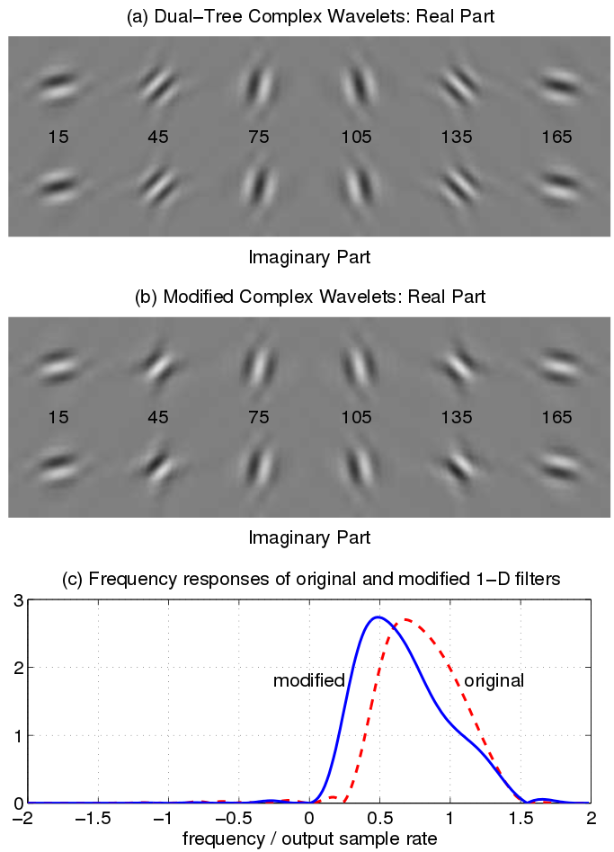
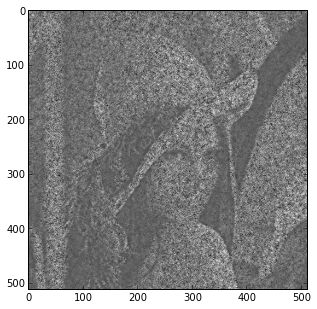

Variant transforms
==================

In addition to the basic 1, 2 and 3 dimensional DT-CWT, this library also
supports a selection of variant transforms.

Rotational symmetry modified wavelet transform
----------------------------------------------

For some applications, one may prefer the subband responses to be more rotationally similar. 

In the original 2-D DTCWT, the 45 and 135 degree subbands have passbands whose centre frequencies 
are somewhat further from the origin than those of the other four subbands. This results from 
the combination of two highpass 1-D wavelet filters to produce 2-D wavelets. The remaining 
subbands combine highpass and lowpass 1-D filters, and hence their centre frequencies are a 
factor of approximately sqrt(1.8) closer to the origin of the frequency plane.

The dtwavexfm2b() function employs an alternative bandpass 1-D filter in place of the highpass 
filter for the appropriate subbands. The image below illustrates the relevant differences in impulse 
and frequency responses[1].

Usage is very similar to the standard 2-D transform function, but the only supported parameters are 
'near_sym_b_bp', 'qshift_b_bp'. These arguments are optional, but it is best practice to include them
so that your intentions are clear (and because it is easier for others to spot than the difference 
between 2() and 2b().

.. code-block:: console

    Yl, Yh = dtcwt.dtwavexfm2b(image, tfmlevel, 'near_sym_b_bp', 'qshift_b_bp')

While the Hilbert transform property of the DTCWT is preserved, perfect reconstruction is lost.
However, in applications such as machine vision, where all subsequent operations on the image
take place in the transform domain, this is of relatively minor importance.

For full details, refer to:

[1] N. G. Kingsbury. Rotation-invariant local feature matching with complex
wavelets. *In Proc. European Conference on Signal Processing (EUSIPCO)*,
pages 901–904, 2006. 2, 18, 21

-------
Example
-------

Working on the Lena image, the standard 2-D DTCWT achieves perfect reconstruction:

.. codeblock:: console

	# Perform the standard 2-D DTCWT
	Yl, Yh = dtcwt.dtwavexfm2(image, tfmlevel, 'near_sym_b', 'qshift_b')
	
	# Perform the inverse transform
	Z = dtcwt.dtwaveifm2(Yl, Yh, biort='near_sym_b', qshift='qshift_b')
	
	# Show the error
	imshow(Z-image, cmap=cm.gray)

The error signal appears to be just noise, which we can attribute to floating-point precision.

Using the modified wavelets yields the following result:

.. codeblock:: console

	# Perform the symmetry-modified 2-D DTCWT
	Yl, Yh = dtcwt.dtwavexfm2b(image, tfmlevel, 'near_sym_b_bp', 'qshift_b_bp')
	
	# Perform the inverse transform
	Z = dtcwt.dtwaveifm2b(Yl, Yh, biort='near_sym_b_bp', qshift='qshift_b_bp')
	
	# Show the error
	imshow(Z-image, cmap=cm.gray)

..figure:: lena_error.png

As we would expect, the error is more significant, but only near 45 and 135 degree edge features.
